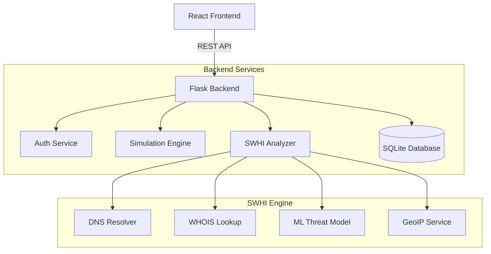

# Unified Cybersecurity Simulation and Threat Intelligence Platform
## Comprehensive Project Report

**Date:** December 11, 2025  
**Version:** 2.0 (Integrated Release)

---

## 1. Executive Summary

The **Unified Cybersecurity Simulation and Threat Intelligence Platform** is a state-of-the-art enterprise solution designed to bridge the gap between employee awareness training and real-time threat detection. unlike traditional Learning Management Systems (LMS), this platform combines immersive, gamified simulations with functional threat intelligence tools.

The system serves two primary functions:
1.  **Human Risk Management**: Training employees via realistic phishing simulations, quizzes, and role-playing scenarios.
2.  **Active Defense**: Empowering users to investigate suspicious domains using the integrated **Suspicious Website Hosting Identifier (SWHI)**.

---

## 2. Key Modules & Features

### A. Core Training Modules
*   **Phishing Simulations**: Realistic email scenarios (e.g., Urgent CEO Request, Password Reset) that test user vigilance. Tracks click rates and reporting times.
*   **Adaptive Quizzes**: Dynamic assessments that adjust difficulty based on user performance.
*   **Role-Based Simulations**: Interactive text-based adventures (e.g., "The Insider Threat") where users make critical decisions affecting the storyline.
*   **Certificate Generation**: Automatically issues PDF certificates upon course completion.

### B. Threat Intelligence (SWHI Integration)
The flagship feature for real-time analysis:
*   **Domain Analysis**: Investigates domains for DNS records, SSL validity, and hosting provider details.
*   **Geospatial Tracking**: Visualizes server locations on an interactive world map using Leaflet.js.
*   **ML-Powered Risk Scoring**: Uses Machine Learning to predict the likelihood of a domain being malicious (0-100 Score).
*   **Features Analyzed**:
    *   *Entropy*: Detects randomly generated domain names.
    *   *Homoglyphs*: Identifies "typosquatting" (e.g., `goog1e.com`).
    *   *TTL & RTT*: Analyzes network metrics for suspicious anomalies.
    *   *CDN Detection*: Identifies if a site is hiding behind Cloudflare/Akamai.

### C. Gamification & Analytics
*   **User Dashboard**: Personal progress tracking through a "Cyber Health" score.
*   **Leaderboard**: competitive ranking of employees by department.
*   **Threat Feed**: Real-time ticker of global cybersecurity news and internal alerts.

### D. Administrative Control
*   **Role-Based Access Control (RBAC)**: Strict separation between `Admin` and `User` roles.
*   **Admin Dashboard**: Exclusive view for security teams to monitor organization-wide metrics, simulation success rates, and user vulnerabilities.
*   **AI Reporting**: Automated generation of text summaries regarding organizational security posture.

---

## 3. Technology Stack

### Frontend (Client-Side)
*   **Framework**: React.js (v18+)
*   **Styling**: Tailwind CSS (with Glassmorphism design system)
*   **Animation**: Framer Motion (for smooth UI transitions)
*   **Mapping**: Leaflet / React-Leaflet
*   **Icons**: Lucide-React
*   **Visuals**: Chart.js for data visualization

### Backend (Server-Side)
*   **Framework**: Flask (Python)
*   **Database**: SQLite with SQLAlchemy ORM (Scalable to PostgreSQL)
*   **Auth**: JWT (JSON Web Tokens) & Session-based authentication
*   **Network Tools**: `dnspython`, `python-whois`, `requests`
*   **Machine Learning**: `scikit-learn`, `pandas`, `numpy` (Random Forest Classifier)

---

## 4. System Architecture

### Database Schema
*   **User**: `id`, `name`, `email`, `role`, `department`, `score`
*   **Simulation**: `id`, `template`, `difficulty`
*   **UserInteraction**: `id`, `user_id`, `action`, `is_correct`
*   **SWHIAnalysis**: `id`, `domain`, `score`, `ip_data`, `ml_prediction`

---

## 5. Security Implementation

1.  **Input Sanitization**: All domain inputs are sanitized to prevent SSRF (Server-Side Request Forgery) attacks.
2.  **Rate Limiting**: The SWHI API is limited to 5 requests/minute per user to prevent abuse.
3.  **Password Hashing**: Uses `Werkzeug` security helpers (PBKDF2 sha256) for password storage.
4.  **Route Protection**: Frontend guards (`<Navigate />`) prevent unauthorized access to Admin pages.
5.  **Blueprint Registration**: Modular backend structure using Flask Blueprints for scalability.

---

## 6. User Manual & Operations

### Access Roles
| Role | Permissions | Dashboard View |
|:---|:---|:---|
| **User** | Take Quizzes, Run Simulations, Use SWHI, View Own Stats | Standard Dashboard |
| **Admin** | View All Stats, Manage Users, See AI Reports, Access Admin Dashboard | Extended Admin Dashboard |

### Default Credentials (Demo)
*   **Admin User**: `lisa.davis@company.com` / `password123`
*   **Standard User**: `john.smith@company.com` / `password123`

### How to Run
1.  **Start All Services**: Run `start_vodafone_swhi.bat` (Windows).
2.  **Access URL**: `http://localhost:3000`

---

## 7. Future Roadmap
1.  **PDF Reports for SWHI**: Downloadable forensic reports for legal/compliance.
2.  **Multi-Factor Authentication (MFA)**: Adding TOTP support.
3.  **External API Integration**: Connecting with VirusTotal API for broader threat data.
4.  **Email Campaign Manager**: Allow Admins to craft custom phishing templates via UI.

